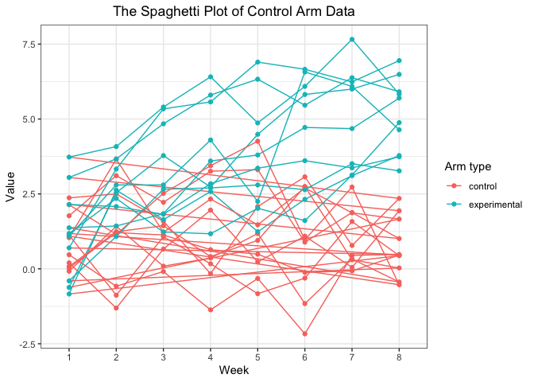

P8105 - Homework 5
================

``` r
library(tidyverse)
library(purrr)
```

### Problem 1

#### Part 1 - Load & describe the raw data

``` r
homicide_data = read_csv("data/homicide-data.csv") %>%
    janitor::clean_names()
```

    ## Rows: 52179 Columns: 12

    ## ── Column specification ────────────────────────────────────────────────────────
    ## Delimiter: ","
    ## chr (9): uid, victim_last, victim_first, victim_race, victim_age, victim_sex...
    ## dbl (3): reported_date, lat, lon

    ## 
    ## ℹ Use `spec()` to retrieve the full column specification for this data.
    ## ℹ Specify the column types or set `show_col_types = FALSE` to quiet this message.

The original raw data contains 52179 rows and 12 columns, which records
the uid, reported_date, victim_last, victim_first, victim_race,
victim_age, victim_sex, city, state, lat, lon, disposition of each
incident.

#### Part 2 - Summarize within cities

``` r
homicide_data_within_cities_total = 
  homicide_data %>%
  mutate(city_state = paste(city, state, sep = ",")) %>%
  count(city_state)
  
homicide_data_within_cities_unsolved = 
  homicide_data %>%
  filter(disposition %in% c("Closed without arrest","Open/no arrest")) %>%
  mutate(city_state = paste(city, state, sep = ",")) %>%
  count(city_state)  

homicide_data_within_cities_summary = left_join(
  homicide_data_within_cities_total, 
  homicide_data_within_cities_unsolved, 
  by = "city_state") %>%
  select(City=city_state,Total=n.x,Unsolved=n.y) %>%
  mutate(Unsolved = replace_na(Unsolved,0))

knitr::kable(head(homicide_data_within_cities_summary))
```

| City           | Total | Unsolved |
|:---------------|------:|---------:|
| Albuquerque,NM |   378 |       52 |
| Atlanta,GA     |   973 |       58 |
| Baltimore,MD   |  2827 |      152 |
| Baton Rouge,LA |   424 |       16 |
| Birmingham,AL  |   800 |       64 |
| Boston,MA      |   614 |        0 |

### Problem 2

#### Part 1 - Import Data

``` r
file_names = list.files(path = "./data/p2")

read_single_file = function(x){
  line = read_csv(paste("./data/p2/",x,sep="")) %>%
    mutate(name = x) %>%
    relocate(name)
  return(line)
}

info = map_dfr(file_names,read_single_file)

knitr::kable(head(info))
```

| name       | week_1 | week_2 | week_3 | week_4 | week_5 | week_6 | week_7 | week_8 |
|:-----------|-------:|-------:|-------:|-------:|-------:|-------:|-------:|-------:|
| con_01.csv |   0.20 |  -1.31 |   0.66 |   1.96 |   0.23 |   1.09 |   0.05 |   1.94 |
| con_02.csv |   1.13 |  -0.88 |   1.07 |   0.17 |  -0.83 |  -0.31 |   1.58 |   0.44 |
| con_03.csv |   1.77 |   3.11 |   2.22 |   3.26 |   3.31 |   0.89 |   1.88 |   1.01 |
| con_04.csv |   1.04 |   3.66 |   1.22 |   2.33 |   1.47 |   2.70 |   1.87 |   1.66 |
| con_05.csv |   0.47 |  -0.58 |  -0.09 |  -1.37 |  -0.32 |  -2.17 |   0.45 |   0.48 |
| con_06.csv |   2.37 |   2.50 |   1.59 |  -0.16 |   2.08 |   3.07 |   0.78 |   2.35 |

#### Part 2 - Tidy results

``` r
info = info %>%
  mutate(arm = ifelse(substring(name,1,3)=="con","control","experimental")) %>%
  mutate(id = as.numeric(substring(name,5,6))) %>%
  select(id,arm,everything(),-name) %>%
  pivot_longer(week_1:week_8,names_to = "week",names_prefix = "week_") %>%
  janitor::clean_names()

knitr::kable(head(info))
```

|  id | arm     | week | value |
|----:|:--------|:-----|------:|
|   1 | control | 1    |  0.20 |
|   1 | control | 2    | -1.31 |
|   1 | control | 3    |  0.66 |
|   1 | control | 4    |  1.96 |
|   1 | control | 5    |  0.23 |
|   1 | control | 6    |  1.09 |

#### Part 3 - Plot Data

``` r
ggplot(info,aes(x=week,y=value,color=arm)) + 
  geom_path(aes(group=id)) +
  geom_point() +
  labs(
    title = "The Spaghetti Plot of Control Arm Data",
    color = "Arm type") +
  ylab("Value")+
  xlab("Week")+
  theme_bw() +
  theme(plot.title = element_text(hjust = 0.5))
```

<!-- -->

#### Part 4 - Observations

From the spaghetti plot above, we observe the starting values for both
the control and experimental arms are at a same level. However, as time
goes by, the values for the experimental arms increase while the values
for the control arms remain basically unchanged.

### Problem 3

``` r
set.seed(10)

iris_with_missing = iris %>% 
  map_df(~replace(.x, sample(1:150, 20), NA)) %>%
  mutate(Species = as.character(Species))

knitr::kable(head(iris_with_missing))
```

| Sepal.Length | Sepal.Width | Petal.Length | Petal.Width | Species |
|-------------:|------------:|-------------:|------------:|:--------|
|          5.1 |         3.5 |          1.4 |         0.2 | setosa  |
|          4.9 |         3.0 |          1.4 |         0.2 | setosa  |
|          4.7 |         3.2 |          1.3 |         0.2 | setosa  |
|          4.6 |         3.1 |          1.5 |          NA | setosa  |
|          5.0 |         3.6 |          1.4 |         0.2 | setosa  |
|          5.4 |         3.9 |          1.7 |         0.4 | setosa  |

``` r
fill_in_missings = function(x){
  if(is.numeric(x)){
    
    x = ifelse(is.na(x), mean(x, na.rm = TRUE), x)
    
  } else if(is.character(x)){
    
    x = ifelse(is.na(x), "virginica", x)
    
  } else{
    stop("Input vector should be either numeric or character.")
  }
  
  return(x)
}

iris_filled_in = map_dfr(iris_with_missing, fill_in_missings)

knitr::kable(head(iris_filled_in))
```

| Sepal.Length | Sepal.Width | Petal.Length | Petal.Width | Species |
|-------------:|------------:|-------------:|------------:|:--------|
|          5.1 |         3.5 |          1.4 |    0.200000 | setosa  |
|          4.9 |         3.0 |          1.4 |    0.200000 | setosa  |
|          4.7 |         3.2 |          1.3 |    0.200000 | setosa  |
|          4.6 |         3.1 |          1.5 |    1.192308 | setosa  |
|          5.0 |         3.6 |          1.4 |    0.200000 | setosa  |
|          5.4 |         3.9 |          1.7 |    0.400000 | setosa  |

``` r
sum(is.na(iris_with_missing)) # Calculate number of NAs in the original table
```

    ## [1] 100

``` r
sum(is.na(iris_filled_in)) # Calculate number of NAs in the filled table
```

    ## [1] 0
